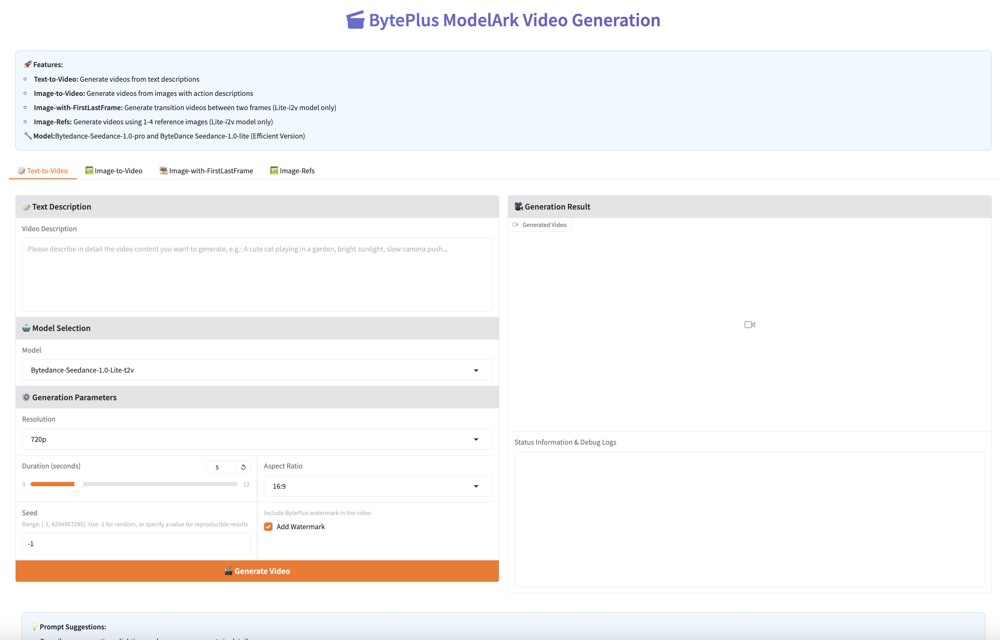

# BP-Training-GenVideoWeb

## 🚀 Seedance V2 Video Generation Platform

A comprehensive AI video generation platform powered by BytePlus Seedance models, featuring automated Terraform deployment on BytePlus Cloud Infrastructure.

### ✨ Features

- **🎥 Advanced Video Generation**: Support for Text-to-Video and Image-to-Video generation
- **🧠 Multiple AI Models**: 
  - Seedance 1.0 Pro (High-quality generation)
  - Seedance 1.0 Lite T2V (Fast text-to-video)
  - Seedance 1.0 Lite I2V (Fast image-to-video)
- **🌐 Web Interface**: User-friendly Gradio web interface
- **☁️ Cloud Deployment**: Automated infrastructure provisioning with Terraform
- **🔒 Secure Configuration**: Environment-based API key management
- **📊 Real-time Monitoring**: Built-in logging and status tracking

---

## 📁 Project Structure

```
BP-Training-GenVideoWeb/
├── README.md                           # This file - main project documentation
└── terraform-seedance-v2/             # Terraform deployment configuration
    ├── main.tf                         # Main Terraform configuration
    ├── variables.tf                    # Variable definitions
    ├── outputs.tf                      # Output definitions
    ├── providers.tf                    # Provider configuration
    ├── user-data.sh                    # EC2 user data script
    ├── terraform.tfvars.example        # Example configuration file
    ├── .gitignore                      # Git ignore rules
    ├── MANUAL_DEPLOYMENT.md            # Manual deployment guide
    ├── TROUBLESHOOTING.md              # Troubleshooting guide
    └── seedance-v2/                    # Application source code
        ├── app.py                      # Main Gradio application
        ├── requirements.txt            # Python dependencies
        └── README.md                   # Application documentation
```

---

## 🛠️ Deployment Options

### Stage 1: Automated Terraform Deployment Infrastructure

#### Prerequisites
- [Terraform](https://www.terraform.io/downloads.html) >= 1.0
- BytePlus Cloud account with API access
- BytePlus API credentials (Access Key & Secret Key)
- BytePlus Seedance API key

#### Quick Start

1. **Clone the repository**
   ```bash
   git clone https://github.com/kookliu/BP-Training-GenVideoWeb.git
   cd BP-Training-GenVideoWeb/terraform-seedance-v2
   ```

2. **Configure credentials**
   ```bash
   # Copy example configuration
   cp terraform.tfvars.example terraform.tfvars
   
   # Edit configuration with your credentials
   vi terraform.tfvars
   ```

#### Configuration Variables

Create `terraform.tfvars` file with your credentials:

```hcl
# BytePlus Access Credentials
access_key = "your_access_key_here"
secret_key = "your_secret_key_here"

# Region Configuration
region            = "ap-southeast-1"
availability_zone = "ap-southeast-1a"

# Instance Configuration
instance_name = "seedance-v2-server"
instance_type = "ecs.t2-c1m1.large"
key_pair_name = "seedance-keypair"

# Seedance Application Configuration
byteplus_api_key  = "your_byteplus_api_key_here"
byteplus_base_url = "https://ark.ap-southeast.bytepluses.com/api/v3"
```


3. **Initialize and deploy**
   ```bash
   # Initialize Terraform
   terraform init
   
   # Plan deployment
   terraform plan
   
   # Deploy infrastructure
   terraform apply
   ```


#### Configuration Variables

Create `terraform.tfvars` file with your credentials:

```hcl
# BytePlus Access Credentials
access_key = "your_access_key_here"
secret_key = "your_secret_key_here"

# Region Configuration
region            = "ap-southeast-1"
availability_zone = "ap-southeast-1a"

# Instance Configuration
instance_name = "seedance-v2-server"
instance_type = "ecs.t2-c1m1.large"
key_pair_name = "seedance-keypair"

# Seedance Application Configuration
byteplus_api_key  = "your_byteplus_api_key_here"
byteplus_base_url = "https://ark.ap-southeast.bytepluses.com/api/v3"
```

### Stage 2: Manual Deployment Application

If you prefer manual deployment or need custom configuration, follow the detailed manual deployment guide below:

## 📋 Prerequisites

1. ✅ Infrastructure created via Terraform (ECS instance, network, security groups, etc.)
2. ✅ SSH private key file (usually `seedance-keypair.pem`)
3. ✅ Server's public IP address
4. ✅ BytePlus API key and base URL

---

## 🚀 Deployment Steps

### Step 1: Connect to Server

```bash
# Set private key permissions
chmod 400 seedance-keypair.pem

# SSH connect to server
ssh -i seedance-keypair.pem root@<SERVER_IP>
```

### Step 2: Update System and Install Dependencies

```bash
# Update system packages
apt-get update

# Install required system packages
apt-get install -y \
    nginx \
    python3 \
    python3-venv \
    python3-pip \
    supervisor \
    git \
    vim \
    htop \
    curl \
    wget \
    unzip

# Verify Python version
python3 --version
# Should show Python 3.12.x
```

### Step 3: Create Application Directory

```bash
# Create application directory
mkdir -p /opt/seedance-v2
cd /opt/seedance-v2

# Verify current directory
pwd
# Should show: /opt/seedance-v2
```

### Step 4: Download Application Files from GitHub

```bash
# Set GitHub raw file URL
GITHUB_BASE="https://raw.githubusercontent.com/kookliu/BP-Training-GenVideoWeb/refs/heads/main/terraform-seedance-v2/seedance-v2/"

# Download main application file
curl -L -o app.py "$GITHUB_BASE/app.py"

# Download dependencies file
curl -L -o requirements.txt "$GITHUB_BASE/requirements.txt"

# Download README file
curl -L -o README.md "$GITHUB_BASE/README.md"

# Verify downloaded files
ls -la
# Should see: app.py, requirements.txt, README.md
```

### Step 5: Create Python Virtual Environment

```bash
# Create virtual environment
python3 -m venv venv

# Activate virtual environment
source venv/bin/activate

# Verify virtual environment
echo $VIRTUAL_ENV
# Should show: /opt/seedance-v2/venv

# Upgrade pip
pip install --upgrade pip

# Install application dependencies
pip install -r requirements.txt
```

### Step 6: Configure Environment Variables

Create environment variables file:

```bash
# Create environment variables file
cat > .env << 'EOF'
ARK_API_KEY=your_modelArk_api_key_here
ARK_BASE_URL=https://ark.ap-southeast.bytepluses.com/api/v3
EOF

# Set file permissions (protect API key)
chmod 600 .env

# Verify environment variables file
cat .env
```

### Step 7: Test Application

```bash
# Test run application in background
source .env
export ARK_API_KEY ARK_BASE_URL

# Test if application can start normally
python3 app.py &

# Wait a few seconds
sleep 5

# Check if application is running
ps aux | grep app.py

# Check if port is listening
netstat -tlnp | grep 7860

# Stop test process
pkill -f app.py
```

### Step 8: Configure Nginx Reverse Proxy

```bash
# Create Nginx configuration file
cat > /etc/nginx/sites-available/seedance << 'EOF'
server {
    listen 80;
    server_name _;
    client_max_body_size 100M;

    location / {
        proxy_pass http://127.0.0.1:7860;
        proxy_set_header Host $host;
        proxy_set_header X-Real-IP $remote_addr;
        proxy_set_header X-Forwarded-For $proxy_add_x_forwarded_for;
        proxy_set_header X-Forwarded-Proto $scheme;
        
        # WebSocket support for Gradio
        proxy_http_version 1.1;
        proxy_set_header Upgrade $http_upgrade;
        proxy_set_header Connection "upgrade";
        
        # Timeout settings
        proxy_connect_timeout 300;
        proxy_send_timeout 300;
        proxy_read_timeout 300;
    }
}
EOF

# Enable site configuration
ln -sf /etc/nginx/sites-available/seedance /etc/nginx/sites-enabled/

# Remove default site
rm -f /etc/nginx/sites-enabled/default

# Test Nginx configuration
nginx -t

# Restart Nginx
systemctl restart nginx
systemctl enable nginx

# Check Nginx status
systemctl status nginx
```

### Step 9: Create systemd Service

```bash
# Create systemd service file
cat > /etc/systemd/system/seedance.service << 'EOF'
[Unit]
Description=Seedance V2 Video Generation Application
After=network.target

[Service]
Type=simple
User=root
WorkingDirectory=/opt/seedance-v2
Environment=ARK_API_KEY=your_byteplus_api_key_here
Environment=ARK_BASE_URL=https://ark.ap-southeast.bytepluses.com/api/v3
Environment=PYTHONPATH=/opt/seedance-v2
ExecStart=/opt/seedance-v2/venv/bin/python app.py
Restart=always
RestartSec=10
StandardOutput=journal
StandardError=journal

# Resource limits
LimitNOFILE=65536

[Install]
WantedBy=multi-user.target
EOF

# ⚠️ Important: Edit service file, replace with real API key
vim /etc/systemd/system/seedance.service
# Replace "your_modelArk_api_key_here" with actual API key

# Reload systemd configuration
systemctl daemon-reload

# Enable and start service
systemctl enable seedance
systemctl start seedance

# Check service status
systemctl status seedance
```

### Step 10: Verify Deployment

```bash
# 1. Check service status
systemctl status seedance
systemctl status nginx

# 2. Check port listening
netstat -tlnp | grep -E "(80|7860)"

# 3. Check application logs
journalctl -u seedance -f --no-pager -n 20

# 4. Test local access
curl -I http://localhost
curl -I http://localhost:7860

# 5. Get public IP
curl -s ifconfig.me

# 6. Test external access (from local machine)
curl -I http://PUBLIC_IP

```

---


## 🌐 Access Application

After deployment is complete, you can access the application via:

### Web Interface Access

- **Main access URL**: `http://PUBLIC_IP` (via Nginx proxy)
- **Direct access URL**: `http://PUBLIC_IP:7860` (direct Gradio access)





### Cleanup

```bash
# Destroy infrastructure
terraform destroy
```

---

## 


## 🔧 Common Management Commands

### Service Management
```bash
# View service status
systemctl status seedance

# Restart service
systemctl restart seedance

# Stop service
systemctl stop seedance

# Start service
systemctl start seedance

# View service logs
journalctl -u seedance -f

# View recent error logs
journalctl -u seedance --since "1 hour ago" -p err
```

### Application Management
```bash
# Enter application directory
cd /opt/seedance-v2

# Activate virtual environment
source venv/bin/activate

# Update application code
curl -L -o app.py "https://raw.githubusercontent.com/kookliu/BP-Training-GenVideoWeb/main/seedance-v2/app.py"

# Update dependencies
pip install -r requirements.txt

# Restart service to apply updates
systemctl restart seedance
```

### Nginx Management
```bash
# Test Nginx configuration
nginx -t

# Restart Nginx
systemctl restart nginx

# View Nginx logs
tail -f /var/log/nginx/access.log
tail -f /var/log/nginx/error.log
```

---


### SSH Management Access

```bash
ssh -i seedance-keypair.pem root@PUBLIC_IP
```

---

## 🐛 Manual Deployment Troubleshooting

### Common Issues

#### 1. Service Cannot Start
```bash
# View detailed error information
journalctl -u seedance -n 50

# Check Python environment
cd /opt/seedance-v2
source venv/bin/activate
python3 app.py
```

#### 2. Port Cannot Be Accessed
```bash
# Check firewall (Ubuntu disabled by default)
ufw status

# Check port listening
netstat -tlnp | grep -E "(80|7860)"

# Check security group settings (in BytePlus console)
```

#### 3. API Key Error
```bash
# Check environment variables
systemctl show seedance --property=Environment

# Update API key
nano /etc/systemd/system/seedance.service
systemctl daemon-reload
systemctl restart seedance
```

#### 4. Virtual Environment Issues
```bash
# Recreate virtual environment
cd /opt/seedance-v2
rm -rf venv
python3 -m venv venv
source venv/bin/activate
pip install --upgrade pip
pip install -r requirements.txt
systemctl restart seedance
```

---

## 📝 Configuration File Locations

| File/Directory | Path | Description |
|----------------|------|-------------|
| Application Directory | `/opt/seedance-v2` | Main application directory |
| Python Virtual Environment | `/opt/seedance-v2/venv` | Python virtual environment |
| Systemd Service | `/etc/systemd/system/seedance.service` | Service configuration file |
| Nginx Configuration | `/etc/nginx/sites-available/seedance` | Nginx site configuration |
| Application Logs | `journalctl -u seedance` | System logs |
| Nginx Logs | `/var/log/nginx/` | Nginx access and error logs |

---


---

## 🏗️ Infrastructure Components

The Terraform configuration creates the following resources:

### Compute Resources
- **ECS Instance**: GPU-enabled instance for AI workloads (`ecs.g3i.large`)
- **Key Pair**: SSH key pair for secure access
- **Security Group**: Firewall rules for HTTP/HTTPS/SSH access

### Network Resources
- **VPC**: Virtual Private Cloud with custom CIDR
- **Subnet**: Public subnet for internet access
- **Internet Gateway**: For external connectivity
- **Route Table**: Routing configuration

### Application Stack
- **Ubuntu 22.04**: Latest LTS operating system
- **Python 3.12**: Latest Python runtime
- **Nginx**: Reverse proxy and web server
- **Systemd**: Service management
- **Virtual Environment**: Isolated Python dependencies

---

## 🎮 Using the Application

### Web Interface Features

1. **Model Selection**
   - Choose between Pro and Lite models
   - Select Text-to-Video or Image-to-Video generation

2. **Input Configuration**
   - **Text Prompt**: Describe your desired video content
   - **Image Upload**: Upload reference image (I2V mode)
   - **Advanced Settings**: Configure duration, resolution, and quality

3. **Generation Process**
   - Real-time progress tracking
   - Status updates and error handling
   - Automatic retry mechanisms

4. **Output Management**
   - Video preview and download
   - Generation history
   - Export options

### API Models Available

| Model | Type | Use Case | Speed | Quality |
|-------|------|----------|--------|---------|
| Seedance 1.0 Pro | T2V | High-quality text-to-video | Slower | Highest |
| Seedance 1.0 Lite T2V | T2V | Fast text-to-video | Fast | Good |
| Seedance 1.0 Lite I2V | I2V | Fast image-to-video | Fast | Good |

---

## 🔧 Management & Operations

### Service Management
```bash
# SSH into server
ssh -i seedance-keypair.pem root@YOUR_PUBLIC_IP

# Service operations
systemctl status seedance    # Check status
systemctl restart seedance   # Restart service
systemctl stop seedance      # Stop service
systemctl start seedance     # Start service

# View logs
journalctl -u seedance -f    # Follow logs
```

### Application Updates
```bash
# Navigate to application directory
cd /opt/seedance-v2

# Update application code
curl -L -o app.py "https://raw.githubusercontent.com/kookliu/BP-Training-GenVideoWeb/main/terraform-seedance-v2/seedance-v2/app.py"

# Restart service
systemctl restart seedance
```

### Infrastructure Updates
```bash
# Navigate to terraform directory
cd terraform-seedance-v2

# Apply configuration changes
terraform plan
terraform apply
```

---

## 🐛 Troubleshooting

### Common Issues & Solutions

#### 1. Application Won't Start
```bash
# Check service logs
journalctl -u seedance -n 50

# Verify API credentials
systemctl show seedance --property=Environment

# Test manual startup
cd /opt/seedance-v2
source venv/bin/activate
python3 app.py
```

#### 2. Cannot Access Web Interface
```bash
# Check port listening
netstat -tlnp | grep -E "(80|7860)"

# Verify nginx status
systemctl status nginx

# Check security group settings in BytePlus console
```

#### 3. Video Generation Fails
- Verify BytePlus API key is correct
- Check API quota and limits
- Review application logs for specific errors

📖 **[Complete Troubleshooting Guide](terraform-seedance-v2/TROUBLESHOOTING.md)**

---

## 📊 Monitoring & Logs

### Application Logs
```bash
# Real-time application logs
journalctl -u seedance -f

# Error logs from last hour
journalctl -u seedance --since "1 hour ago" -p err

# Nginx access logs
tail -f /var/log/nginx/access.log
```

### System Monitoring
```bash
# System resource usage
htop

# Disk usage
df -h

# Network connections
netstat -tuln
```

---

## 🔒 Security Considerations

### API Key Security
- API keys are stored as environment variables
- Service files have restricted permissions (600)
- Keys are not logged or exposed in web interface

### Network Security
- Security groups restrict access to necessary ports only
- SSH access requires private key authentication
- HTTPS can be configured with Let's Encrypt (manual setup)

### System Security
- Regular system updates recommended
- Firewall rules configured via security groups
- Root access via SSH key only

---


## 🤝 Contributing

1. Fork the repository
2. Create a feature branch
3. Make your changes
4. Test deployment
5. Submit a pull request

---

## 📄 License

This project is licensed under the MIT License - see the LICENSE file for details.

---

## 🆘 Support

- **Issues**: [GitHub Issues](https://github.com/kookliu/BP-Training-GenVideoWeb/issues)
- **Documentation**: Check the `terraform-seedance-v2/` directory for detailed guides
- **BytePlus Support**: [BytePlus Documentation](https://byteplusapi.com/docs)

---

## 🎯 What's Next?

- [ ] HTTPS/SSL certificate automation
- [ ] Multi-region deployment support
- [ ] Auto-scaling configuration
- [ ] Monitoring dashboard integration
- [ ] CI/CD pipeline setup

---

**Ready to generate amazing AI videos? Start with the Quick Start guide above!** 🚀
